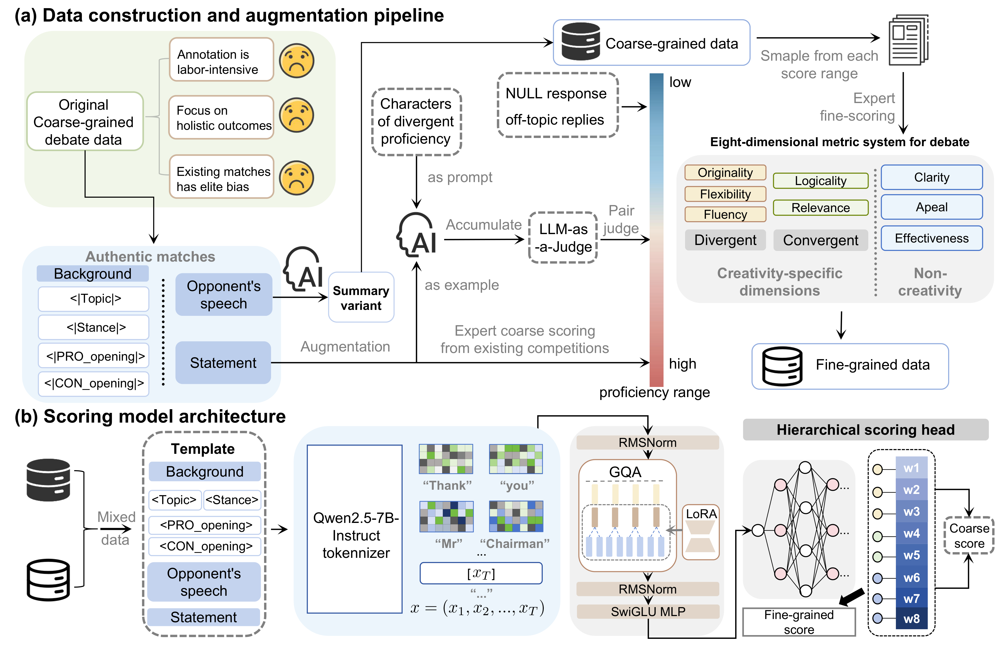
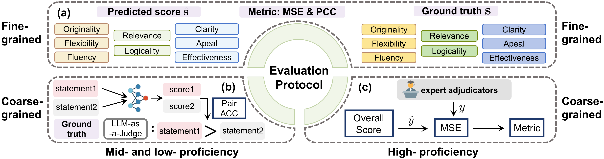
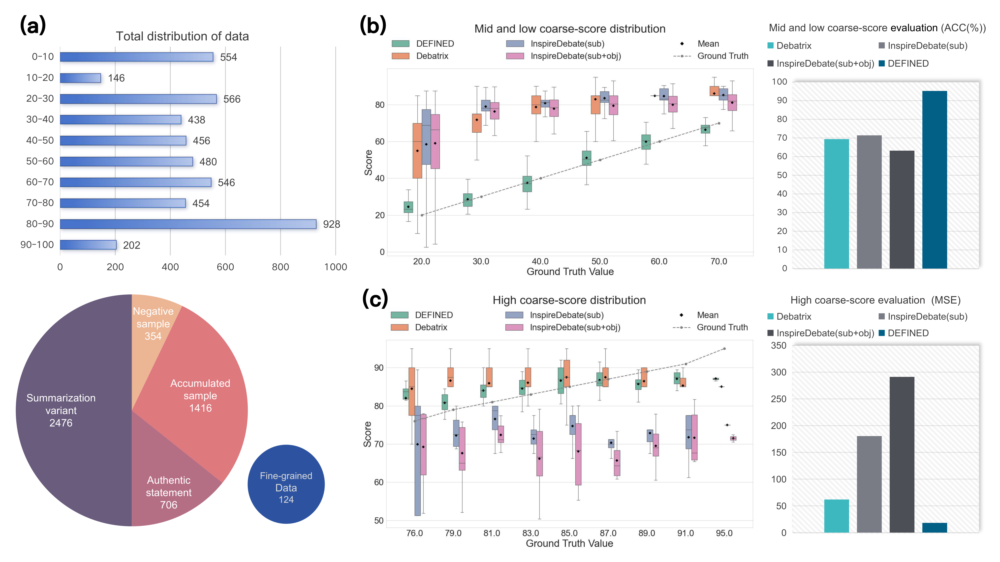
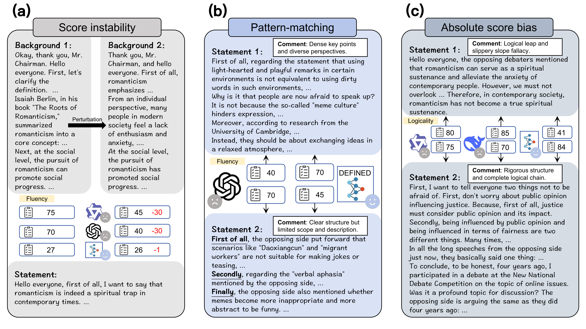
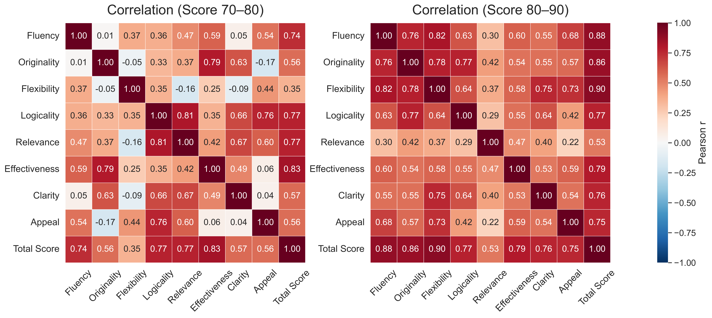

<div align='center'>
<h1>DEFINED: A Data-Efficient Computational Framework for Fine-Grained Creativity Assessment in Debate Scenarios</h1>

Tongzhou Yu*, Mingjia Li*, Hong Qian, Jiajun Guo, Wenkai Wang, Zongbao Zhang, Yaoyu Jiang, Xiangfeng Wang, and Aimin Zhou

*Equal contribution. Hong Qian is the corresponding author.

Nanjing University, East China Normal University, Shanghai Innovation Institute

<a href='https://anonymous.4open.science/r/DEFINED/'></a>
<a href='DEFINED-KDD-2026.pdf'></a>
</div>

------

:sparkles: Welcome to **DEFINED**, a comprehensive repository for **fine-grained creativity assessment in debate scenarios**. This project studies how to move beyond conventional creativity tests and build an ecologically valid, data-efficient scoring framework from authentic debate data.

## 📰 News
- [x] [2026.05] DEFINED repository released.



# Abstract and Contribution

Human creativity has become a critical competency in the era of large language models. Yet, assessing creativity in complex and open-ended environments remains difficult because most existing approaches rely on simplified tasks and large amounts of expensive expert annotations.

Debate provides a naturally rich setting for creativity assessment: it combines **divergent thinking** with **convergent thinking**, requires contextual reasoning, and reflects realistic human judgment under adversarial interaction. However, current automated scoring methods still struggle in such complex settings and often depend on costly human evaluation.

To address this challenge, we propose **DEFINED**, a **d**ata-**e**fficient computational framework for **f**ine-gra**in**ed cr**e**ativity assessment in **d**ebate scenarios.

- **Authentic debate data + triple-constraint augmentation.** We collect real competition statements scored by expert adjudicators and augment them to alleviate elite-data bias.
- **Eight-dimensional metric system.** We model debate creativity through five creativity-related dimensions and three debate-related dimensions, enabling both fine-grained and coarse-grained evaluation.
- **Mixed-granularity training.** We learn from limited fine-grained annotations together with a much larger set of coarse-grained supervision signals.
- **Human-aligned scoring.** DEFINED is designed to approximate the cognitive process of expert adjudicators rather than only predicting a single holistic score.

# Why DEFINED

Creativity assessment in debate is difficult for three main reasons:

- **Annotation cost is high.** A single fine-grained annotation for a long debate statement is expensive and time-consuming.
- **Existing resources are too coarse.** Most debate datasets focus on win/loss or overall quality rather than specific creativity dimensions.
- **Elite bias is severe.** Public debate data are dominated by high-proficiency debaters, while real educational applications also require reliable assessment of mid- and low-proficiency populations.

DEFINED tackles these issues through a unified pipeline that combines authentic competition data, constrained augmentation, hierarchical scoring, and mixed-granularity supervision.

# Framework Overview

The overall framework contains two tightly coupled components:

- **Data construction and augmentation.** We build a mixed-granularity dataset from authentic competitions, synthetic mid-to-low proficiency data, negative samples, and summarization variants.
- **Scoring model.** We use a pre-trained autoregressive language model as the semantic encoder and a hierarchical scoring head to predict eight dimension scores and an overall debate score.


In DEFINED, the eight dimensions include:

- **Creativity-specific dimensions:** Fluency, Originality, Flexibility, Logicality, and Relevance
- **Non-creativity dimensions:** Effectiveness, Clarity, and Appeal

This decomposition allows the model to perform fine-grained creativity assessment while preserving compatibility with coarse-grained overall scoring.

# Evaluation Protocol

To validate both ecological validity and scoring robustness, the paper introduces a **three-modular evaluation protocol**:

- **Fine-grained evaluation:** compares dimension-wise predictions against expert annotations using MSE and PCC.
- **Coarse-grained evaluation on mid-to-low proficiency data:** uses pairwise agreement to assess ranking robustness.
- **Coarse-grained evaluation on authentic high-proficiency data:** uses MSE against top-tier adjudicator scores.



This protocol is important because creativity assessment in debate must work across both **different proficiency levels** and **different annotation granularities**.

# Main Results

DEFINED achieves strong performance across all three evaluation modules:

- **Fine-grained scoring:** average PCC reaches **0.96**, with an average MSE of **43.09**.
- **Mid-to-low proficiency ranking:** pairwise accuracy reaches **95.2%**, substantially outperforming debate-evaluation baselines.
- **High-proficiency scoring:** DEFINED achieves an MSE of **18.23**, much closer to expert adjudicators than prompt-based baselines.



These results indicate that DEFINED not only predicts scores accurately, but also better aligns with the underlying cognitive structure of human debate evaluation.

# Case Study and Interpretability

Beyond aggregate metrics, the paper also analyzes typical failure modes of general LLM-based evaluators, including:

- **Score instability under contextual perturbation**
- **Surface-level pattern matching**
- **Absolute score mismatch**

DEFINED shows stronger robustness against these issues and provides more reliable separation between lower-quality and higher-quality speeches.



The paper also examines inter-dimension correlations, showing that the proposed eight-dimensional metric system captures related yet non-redundant aspects of debate creativity.



# Quick Start

## Installation

```bash
pip install -r requirements.txt
```

## Training

Edit the paths in `data_analysis/debate_creativity_rm.sh` first, including:

- `MODEL_PATH`
- `reward_data_path`
- `template_path`
- `val_path`

Then run:

```bash
cd data_analysis
bash debate_creativity_rm.sh
```

## Inference

Edit the paths in `data_analysis/inference_debate_rm.sh` first, including:

- `MODEL_PATH`
- `ADAPTER_PATH`
- `DATA_PATH`
- `OUTPUT_PATH`

Then run:

```bash
cd data_analysis
bash inference_debate_rm.sh
```

# Repository Structure

## Data Collection (`data_collection/`)

- `data_extraction.py`: extracts and segments debate statements from competition records.
- `inference_generate_pair.py`: generates augmented debate statements for the low-to-mid score range.
- `inference_summary.py`: generates summarization variants for contextual variation.

## Data Analysis (`data_analysis/`)

**Benchmark (`data_analysis/benchmark/`)**

- `Debatrix.py` and `Inspiredebate.py`: baseline methods for coarse-grained scoring comparisons.
- `run_evaluation.py`: fine-grained scoring by calling external APIs.

**DEFINED Training**

- `debate_creativity_rm.py`: main training script.
- `debate_rm_creativity_trainer.py`: trainer and training utilities.
- `accelerate_config_debate_rm.yaml`: accelerate configuration.

**DEFINED Inference**

- `inference_debate_rm.py`: inference script for scoring.
- `inference_debate_rm.sh`: shell entry for inference.
- `qwen2.5-7b.jinja`: prompt template.

# Reference

If you find this repository useful, please consider citing:

```bibtex
@inproceedings{DEFINED2026kdd,
  title     = {DEFINED: A Data-Efficient Computational Framework for Fine-Grained Creativity Assessment in Debate Scenarios},
  author    = {Yu, Tongzhou and Li, Mingjia and Qian, Hong and Guo, Jiajun and Wang, Wenkai and Zhang, Zongbao and Jiang, Yaoyu and Wang, Xiangfeng and Zhou, Aimin},
  booktitle = {Proceedings of the 32nd ACM SIGKDD Conference on Knowledge Discovery and Data Mining V.2},
  year      = {2026},
  doi       = {10.1145/3770855.3817874}
}
```
